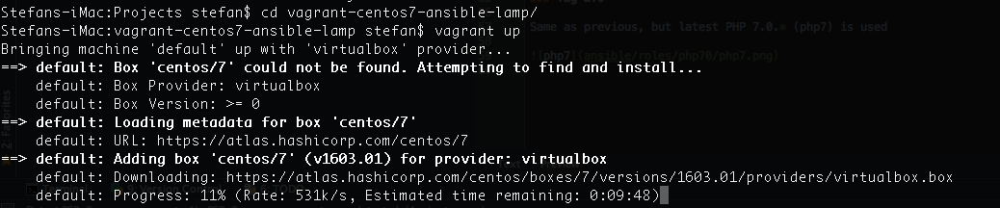

Vagrant Centos 7 lamp using Ansible playbook
=========================================

 
 
 

This personal development VM with Ansible provisioning is **fully working example**. I created this VM in order to 
have a proper php testbed for my php applications. After vagrant up, the main url will welcome you with phpinfo(). 
I hope you will enjoy this VM and I always accept recommendations and requests.

## Guest OS

I am using the lastest CentOS 7 x64 image from official [Hashicorp](https://atlas.hashicorp.com/centos/7) (thanks)

## Prerequisites / Requirements

- [Virtualbox platform](https://www.virtualbox.org/wiki/Downloads)
- [Vagrant](https://docs.vagrantup.com/v2/installation/)
- guest additions to Vagrant `vagrant plugin install vagrant-vbguest`
- [Git](https://git-scm.com/)
- [Ansible](http://docs.ansible.com/ansible/intro_installation.html)
- rsync

## How to run

Create your new folder for your project. Clone this repository into that folder, which will download all configuration
needed to run vagrant machine. Then just run `vagrant up` in terminal and the rest will be done automatically. Open up 
terminal and run these commands:

	$ cd /var/www
	$ mkdir project
	$ cd project
	$ git clone https://github.com/skecskes/vagrant-centos7-ansible-lamp.git
	$ cd vagrant-centos7-ansible-lamp/
	$ vagrant up

Your /var/www/project folder will be synced with with vagrants apache root directory. 
Note, that if you run it first time, vagrant will download the guest OS (414 MB of Centos 7 in this case) box 
from internet, which in my case took 8 minutes and will save it locally so that vagrant can use it later.

## Licence

[GNU GENERAL PUBLIC LICENSE](https://github.com/skecskes/vagrant-centos7-ansible-lamp/blob/master/LICENSE)

## What is included

### Tag 0.1.0

- Apache 2.4.6
- latest php 5.6.*
- latest mySQL MariaDB 5.5.* on port 3306 (user: root, pass: toor)
- phpinfo() on http://10.0.0.10
- phpmyadmin on http://10.0.0.10:9000 (latest version is cloned into vagrantbox)

### Tag 0.2.0

Same as previous, but latest PHP 7.0.* (php7) is used

    
